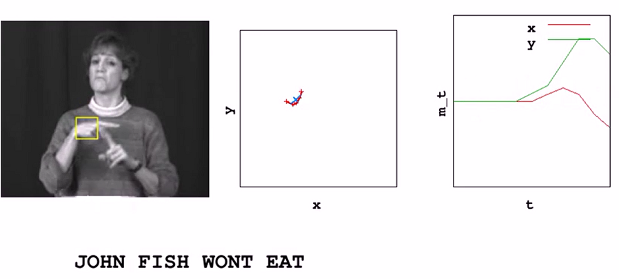
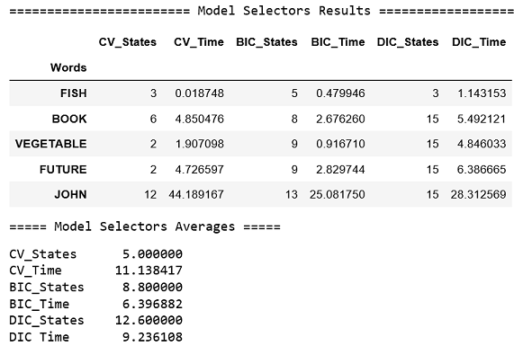
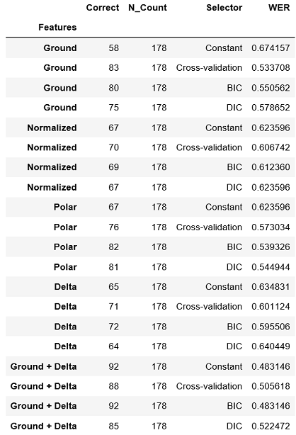

# Introduction
In this repo I discuss building a system to recognize words communicated using the American Sign Language (ASL).   Completion of this [project]( https://github.com/udacity/AIND-Recognizer) was a requirement for Udacity’s program [Artificial Intelligence Nanodegree (AIND) and Specializations.](https://confirm.udacity.com/GGGH2GSK)

# Project Instructions 
The main goal of the project is to develop a word recognizer for American Sign Language video sequences using a probabilistic model.  In particular, the project employs hidden Markov models to analyze a series of measurements taken from videos of American Sign Language (ASL) collected from [RWTH-BOSTON-104 Database](http://www-i6.informatik.rwth-aachen.de/~dreuw/database-rwth-boston-104.php).  For example, in the image below the right-hand x and y locations are plotted as the speaker signs the sentence:

The raw data, train, and test sets are pre-defined. In part 1 of the project we derive a variety of feature sets. In part 2 we implement three different model selection criterion to determine the optimal number of hidden states for each word model. Finally, in Part 3 we implement the recognizer and compare the effects of the different combinations of feature sets and model selectors.

My implementation for this project is located in the `asl_recognizer.ipynb` jupyter notebook.

# Probabilistic Models and HMM
A probabilistic model is one that has an element of uncertainty and uses probability theory to quantify a numerical belief between 0 (certainly false) and 1 (certainly true).  In the context of AI agents and uncertainty, the agent may never know for certain what state it’is in or where it will end up after a sequence of actions.  At the other end of spectrum we have deterministic models where there is no randomness and things can be predicted with certainty as true of false.
Hidden Markov Models (HMMs) are a probabilistic type model, that model randomly changing systems that are assumed to be of a Markov process with unobserved (i.e. hidden) states.  An HMM represents distributions over sequences of observations.  These observations are assumed to be sampled at discrete and equally spaced time intervals and the state of the process is described by a single discrete random variable[1](http://mlg.eng.cam.ac.uk/zoubin/papers/ijprai.pdf).
In our project the single discrete variable is the sign language sequence from the videos for each word.  Each word has an optimal hidden number of states that we have to uncover in part 2 of the project. 

# Feature Selection (Part 1)

In part 1 we implement certain features and then select combinations of these features for training our HMMs.  We are initially given six features which represent the `x` and `y` coordinates distance from the ground of the speakers right hand, left hand and nose:
> 1. `left-x`
> 2. `left-y`
> 3. `right-x`
> 4. `right-y`
> 5. `nose-x`
> 6. `nose-y`   

These are the features we need to implement:
> normalized ground features - normalize the right hand, left hand and nose locations for the speakers height by taking the differences between `x` and `y` locations. (A total of 4 features:  `grnd-ry`,  `grnd-rx`,  `grnd-ly` and `grnd-lx`)

> * normalized cartesian coordinates - use mean and standard deviation statistics and the standard score equation to account for speakers with different heights and arm length (A total of 4 features: `norm-rx`, `norm-ry`, `norm-lx` and `norm-ly`)

> * polar coordinates - calculate polar coordinates with [Cartesian to polar equations](https://en.wikipedia.org/wiki/Polar_coordinate_system#Converting_between_polar_and_Cartesian_coordinates) ( A total of four features: `polar-rr`, `polar-rtheta`, `polar-lr` and `polar-ltheta`)

> * delta difference - the difference in values between one frame and the next frames. (A total of 4 features:`delta-rx`, `delta-ry`, `delta-lx` and `delta-ly` )

The best feature sets I found were the normalized ground and the delta differences for a total of 8 features.  To uncover the best feature sets I first ran histograms on the ground, normalized, polar and delta features.  By exploring the various histograms, I was looking for features which showed signs of multi-modal distribution. Features with wider distribution will allow the model selectors to better capture the underlying data and produce better models. I decided to use the ground features as the starting point as they have wider distributions compared to the other features. I then decided to experiment by adding some of the other features when I ran the recognizer. 

# Model Selection (Part 2)
The objective of the model selection process is to tune the number of states (optimal number of hidden state) for each word HMM prior to testing on unseen data.  We implement three model selectors:
> 1.    [Log likelihood using cross-validation folds (CV)](https://en.wikipedia.org/wiki/Cross-validation_(statistics))
> 2.    [Bayesian Information Criterion (BIC)](https://en.wikipedia.org/wiki/Bayesian_information_criterion)
> 3.    [Discriminative Information Criterion (DIC)](https://en.wikipedia.org/wiki/Deviance_information_criterion)

The implementation for these model selectors can be found in the `my_model_selectors.py ` module.
To gage the performance of the three models we test each on five words.  The performance of each model on these five words is summarized below:

> * The CV selector on average produced the fewest states but it took the most time. Fewer states means less complexity but at the expense of more time.

> * The DIC selector on 4 of the 5 words generated 15 states. Although on average it took less time than the CV selector, it produced more complex models. 

> * The BIC selector on average produced less states than the DIC selector but took longer than the CV selector. 

> * In conclusion the BIC model produced the right balance between complexity and time. 

# Building the Recognizer (Part 3)
In part 3 we use the feature sets from part 1 and the models from part 2 to build a recognizer to train all the words.  The implementation for the recognizer can be found in the `my_recognizer.py` module.  Performance is measured using Word Error Rate (WER), which is the number of words that are incorrect.  The lower the WER the better.  For project completion we were required to achieve a WER of less than 60%.  

I ran all possible combinations of features and model selectors for a total of 20 tests. The test results are summarized below. 

The custom features, which are the combination of ground and delta features, produced the lowest WER of 48% when combined with the Constant and BIC selector models. The ground features had more dispersion and thus allowed the models to better capture the underlying data and produce better results. One interesting finding is that the CV model was one of the best performers and provided evidence to the fact that if we select the right features then the model selector is less important.
